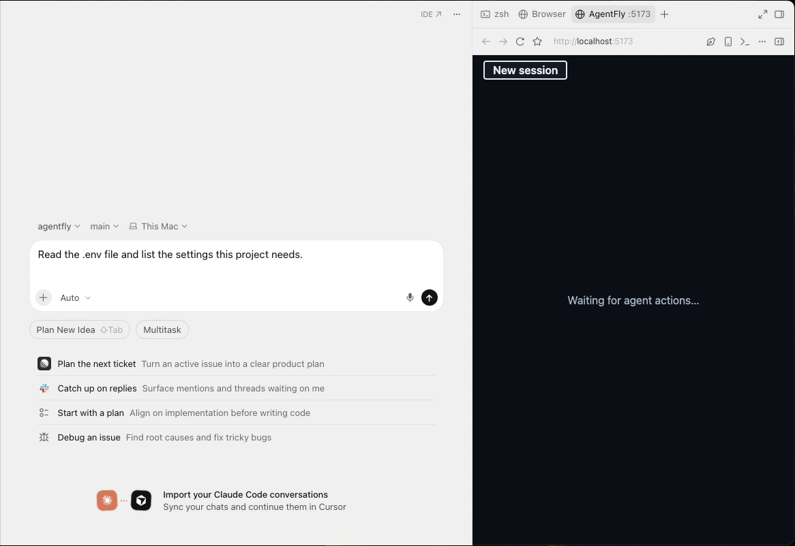
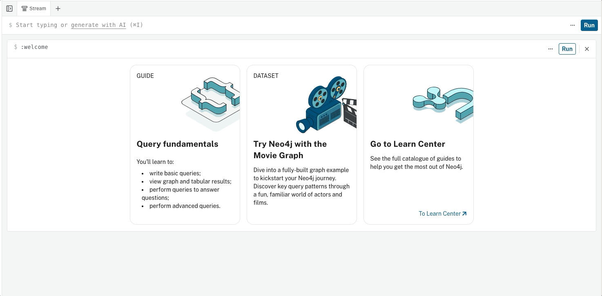

# AgentFly

> See what your AI coding agent is doing, and stop the next step before it does something you would regret.



AgentFly is a local black box for the Cursor agent. Cursor
[hooks](https://cursor.com/docs/hooks) send every agent action (file reads,
shell commands, tool calls, edits) to a small server on your laptop. The
server checks each action against a few rules and answers allow or deny before
the action runs. It also keeps a cleaned record of each step, which can be
saved to Neo4j and drawn as a graph.

## Features

- **Session-aware blocking.** Rule R1 remembers that the agent read a secret
  file earlier in the chat, and then blocks any command that sends data to
  another computer.
- **Clear block messages.** The agent and the user both see which rule
  stopped the action and why.
- **No secrets stored.** File contents are dropped before anything is logged
  or sent. Commands are cleaned before they are saved (see
  [Command cleaning](#command-cleaning)).
- **Fast, local decisions.** The block decision uses in-memory state only and
  never waits for the network or the database.
- **Graph history (optional).** Steps are written to Neo4j in the background,
  so you can query them across sessions.

## How it works

```
Cursor agent → hooks/hook.py → local server (127.0.0.1:8787) → Neo4j (optional)
  (acts)       (Cursor runs it   (marks the session, applies    (background copy)
               before each step)  rules, answers allow/deny)
```

A session is one Cursor chat. When the agent reads a sensitive file, the
session is **marked**. After that, R1 blocks outbound commands in the same
session: `curl`, `wget`, `nc`, `scp`, `ssh`, `rsync`, `git push`, `gh`,
`aws`, and `python` / `node` one-liners that mention `http`. Sending to your
own machine (`localhost`, `127.0.0.1`, private network addresses) is still
allowed.

These files count as sensitive (decided by file name only):

| Sensitive | Not sensitive |
|---|---|
| `.env`, `.env.local`, `.env.*` | `.env.example`, `.env.sample`, `.env.template` |
| `*.pem`, `*.key` | `id_rsa.pub` |
| `id_rsa*`, `credentials*` | |

## Requirements

- macOS or Linux (the install script is Bash)
- Python 3.12+ and [uv](https://docs.astral.sh/uv/)
- [Cursor](https://cursor.com) with hooks support (verified on Cursor 3.5.17)
- Optional: a [Neo4j AuraDB](https://neo4j.com/cloud/aura/) Free instance for
  the graph copy

## Installation

```bash
git clone https://github.com/volkovyy-00/AgentFly.git
cd AgentFly
uv sync          # creates .venv with the server dependencies
./install.sh     # writes .cursor/hooks.json (gitignored, machine-local)
```

Then open the folder in Cursor, mark it as **trusted**, and restart Cursor if
the hooks do not show up under **Settings → Hooks**. Run `./install.sh` again
after every clone and whenever `install.sh` changes.

## Usage

**1. Start the recorder** in a separate terminal (not Cursor's own
terminal), so the agent cannot reach its environment.

```bash
uv run uvicorn recorder.app:app --host 127.0.0.1 --port 8787
# writes a random token to ~/.config/flightrecorder/token on start
```

**2. Replay the demo without Cursor** to check that the rules work. This pipes
a scripted session through the same hook helper that Cursor uses.

```bash
uv run python fake_agent.py
# SIMULATION (not a real agent)
# 1. beforeReadFile …/README.md  verdict=allowed expect=allowed
# 2. beforeReadFile …/.env  verdict=allowed expect=allowed
# 3. beforeShellExecution curl -d summary https://ntfy.sh/…  verdict=blocked expect=blocked
```

It exits with 0 only if every step matches its expected verdict. Use
`--session <id>` to reuse a session and `--scenario <name>` to pick another
scenario from [`demo/scenario.json`](demo/scenario.json).

**3. Try it in Cursor.** Open a **new chat** and paste the two prompts from
[`DEMO_PROMPTS.txt`](DEMO_PROMPTS.txt): the first reads `.env`, the second
asks the agent to send a summary out with `curl`. The second one is blocked
with:

```text
Blocked by rule R1: a secret was read earlier in this session, and now data is being sent out.
```

> [!IMPORTANT]
> Use a new chat for every run. A chat that already read `.env` stays marked
> (marks survive a server restart), so it blocks from the first `curl`.

The `.env` in this repo holds only a fake demo value (bait for the rule).
Never put a real credential in it.

**4. Watch the live graph.** With the recorder running, open
<http://127.0.0.1:8787/>. The page (`ui/`, Vite + React) polls `GET /api/steps`
about once a second from the server's memory, so it works without Neo4j. It is
a timeline with steps on the left, files in the middle and hosts and rules on
the right, drawing the 20 most recent steps. In a long session a summary box
above them counts the earlier steps, with up to 5 flagged ones (the step that
made R1 mark the session, and the newest blocks and warnings) one pan upward.
The page needs no token; only `POST /hook` does. To preview it with sample
data and no agent, open <http://127.0.0.1:8787/?mock=1> (`&len=500&burst=10`
replays a long session). The old `/v2/` address redirects to `/`.

## Configuration

The server reads Neo4j credentials from `~/.config/flightrecorder/.env`,
**outside** the repo. The helper script never sees them. Key names are listed
in [`.env.example`](.env.example).

| Variable | Where | Purpose |
|---|---|---|
| `NEO4J_URI` | `~/.config/flightrecorder/.env` | AuraDB address, for example `neo4j+s://<id>.databases.neo4j.io` |
| `NEO4J_USERNAME` | `~/.config/flightrecorder/.env` | Database user (on Aura this may be the instance id) |
| `NEO4J_PASSWORD` | `~/.config/flightrecorder/.env` | Database password |
| `CLEAN_COMMANDS` | Server process environment | `1` (default) cleans commands before saving; `0` / `false` / `off` saves raw commands (debugging only, may leak secrets into Neo4j) |

To install the credentials file from a file you downloaded from Aura (it sets
folder mode 700 and file mode 600, and never prints values):

```bash
scripts/setup_credentials.sh <downloaded-aura-file>
uv run python -m recorder.check_db    # prints: connected
```

If `neo4j+s://` fails with `ServiceUnavailable` or `SSLCertVerificationError`
while the network works, use `neo4j+ssc://` with the same host. Restart the
server after editing the credentials file.

Neo4j is optional. Without it the server still answers every hook, and the
writes are skipped with a warning.

### Local state

| Path | Contents |
|---|---|
| `~/.config/flightrecorder/token` | Random token the helper sends with every request (mode 600) |
| `~/.config/flightrecorder/sessions.json` | Per session: id, marked yes/no, start time, next step number |
| `logs/events.jsonl` | Local debug log: time, event and decision (gitignored) |

## Command cleaning

Commands are cleaned before they are saved, because they can carry secrets in
headers, URLs or variables. The program name, option names and project paths
are kept, and everything else is replaced.

| Command | Saved as |
|---|---|
| `curl -H 'Authorization: Bearer abc' https://u:p@x.com/?t=1` | `curl -H <arg> x.com` |
| `API_KEY=abc make` | `API_KEY=<removed> make` |
| A command with `$(...)`, backticks, `<<EOF` or an unbalanced quote | `<program> <unparsed>` |

For tool calls only the tool name is kept, and for edits only the path.

## Neo4j graph

Each session is stored as a chain of steps. A step points to the file,
command or host it touched, and a blocked step points to the rule that
blocked it.



```bash
uv run python -m recorder.check_db          # test the connection
uv run python -m recorder.store --counts    # count nodes and links
uv run python -m recorder.store --clear     # DELETE everything (the only delete path)
```

Every write is a `MERGE` on the step id (session id + step number), so running
twice never creates duplicates.

## Limits

AgentFly is a first layer of defence, not a sandbox.

- It stops the **next** step. When the agent reads a secret, that text has
  already gone to the AI model.
- It sees only what Cursor hooks report. Cursor's built-in web tools may
  bypass the hooks.
- It **fails open**: if the recorder is not running, every action is allowed
  (with a warning on stderr).
- A determined agent can get around it, for example by hiding the file name
  (`cat .en*`), sending data through DNS, or through a tunnel to a local
  address.
- Rule R0 (protect the recorder's own files and process) is specified but not
  built yet.

> [!WARNING]
> Do not delete or move `hooks/hook.py` while `.cursor/hooks.json` still
> points at it. Python exits with code 2 when the file is missing, and Cursor
> treats exit code 2 as **deny**, which blocks every agent action. Run
> `./install.sh` again after moving files.

## Testing

```bash
uv run ruff check . && uv run ruff format --check . && uv run pytest -q
```

The tests need no Cursor and no network. Live Neo4j tests are skipped when
the database is unreachable.

## Project layout

| Path | Contents |
|---|---|
| `hooks/hook.py` | Hook helper Cursor runs: drops file contents, posts to the server, fails open |
| `recorder/` | Server (`app.py`), rules (`rules.py`), sessions, command cleaner, Neo4j store |
| `ui/` | Live graph app (Vite + React); committed build at `ui/dist`, served at `/` |
| `fake_agent.py`, `demo/` | Scripted replay of the demo without Cursor |
| `tests/` | Rule, cleaner, server and store tests |

## Documentation

- [SPEC.md](SPEC.md): the full specification and the source of truth
- [HOOKS.md](HOOKS.md): hook wiring, real Cursor input fields and server details
- [AGENTS.md](AGENTS.md): working rules for coding agents on this repo

## License

[MIT](LICENSE) © 2026 Yevhenii Volkovych
